# Portfolio project 1

## Code institute: HTML and CSS
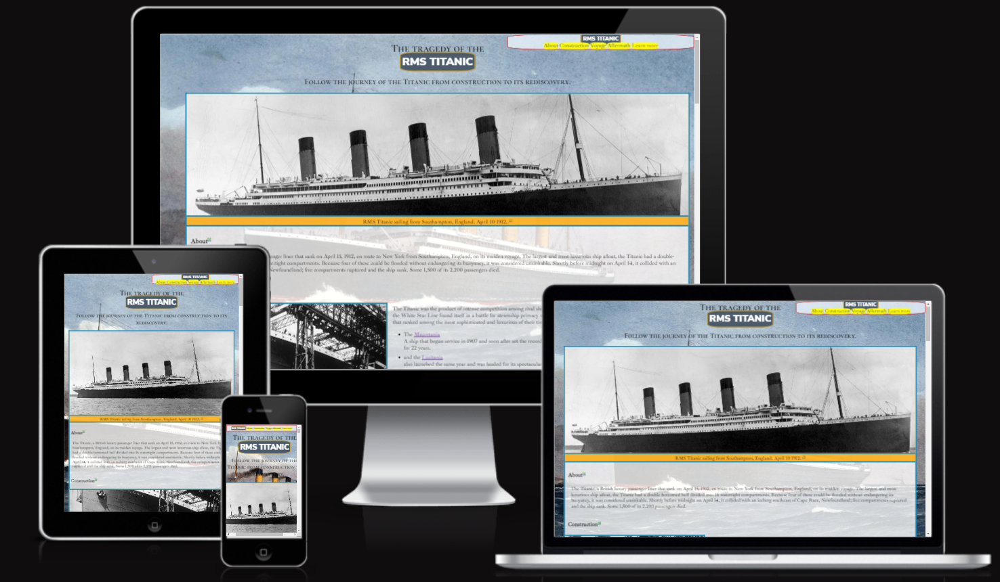
[Live website address](https://james-glennon.github.io/portfolio-project-one/)

*author: James Glennon*

## About

The function of the site is to be a consise summary of the history of the RMS Titanic, from construction to its rediscovery.

## Features

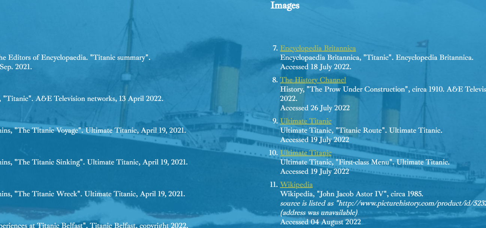

The site includes a background image which covers the entire web page, which can be seen through the transparent elements of the page.

The page also has a fallback background colour similar to the image, to ensure the same colour contrast should the image fail to load.

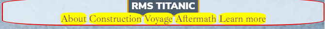
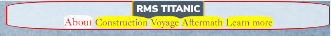

A navigation bar that links to the appropriate sections of the page/website.
The links respond to hover by changing colour and growing while hovered.

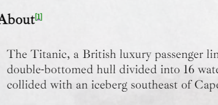
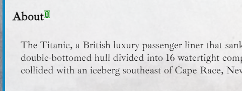

Superscript links that connect to media references relevent to that section of content.
These links respond to hover by swapping text and background colour.

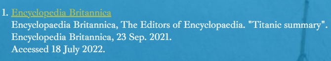

A list of references for text and image content used to create this page, including links to the external sites.
The links include aria labels and open in a new tab.

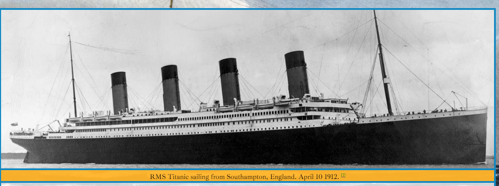
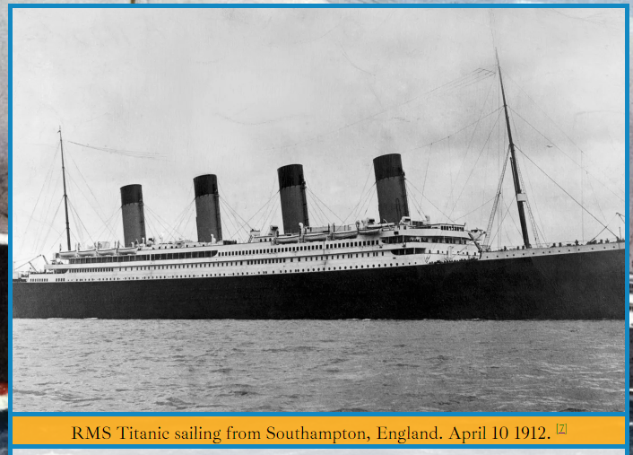

A hero image that responds to browser size by cropping the image, rather that stretching or compressing it.

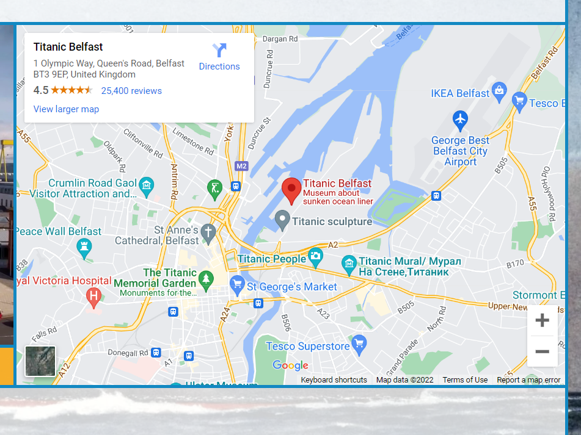


A functional google maps page displaying the location of the Titanic Belfast museum.

## Testing

### Browsers

The live web address included in this read me file was tested on google chrome, microsoft edge, mozilla firefox and opera.

#### Google Chrome

The website was coded using chrome and chrome dev tools, including lighthouse. 

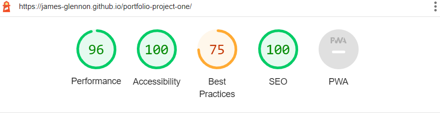

No known issues exclusive to Chrome (see bugs)

#### Microsoft Edge

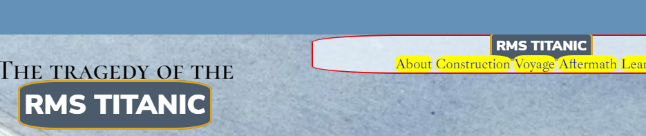

The vertical scrolling of the page allows user to scroll "beyond" the page, revealing the fallback background colour.

#### Mozilla Firefox

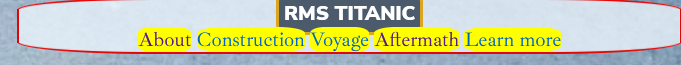

Links in the navigation bar appear to have a green font colour despite no CSS colour rule.

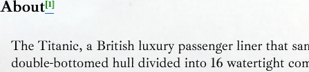

Reference superscript appears with an unexpected underline effect.

#### Opera

No known issues exclusive to Opera.

### Bugs

#### Unexpected gap in background colour

A margin between the last paragraph element of the learn more section created a gap between the background colours of the main section and the footer, resulting in an uncovered line. After attempts to target this paragraph as a 'child of the h4 header with a paragraph sibling' proved unsuccessful,
```
    h4 > p ~ p
```
the footer was given a top margin of minus 2.0 rem to cover the gap.

#### Footer background colour

In order to split the footer into two horizontal divs, one for text references and the other for images, the divs were set to float. Doing this caused the background colour to no longer apply. To remedy this, a hidden paragraph was placed at the end of the footer with the property 'Clear'. The paragraph was given the id of 'signoff'
```
    <p id="signoff">

    #signoff {
    clear: both;
    text-align: center;
    visibility: hidden;
    }
```

#### Side by side image

In the voyage section are two images side by side in the same container div. The images would not fit flush with one another at 50% width, dispite all padding and margins reduced to zero and box-sizing set to border-box.
To remedy this, the images were given negative horizontal margins and greater width as to cover the whole width of the container.
```
    #menu, #astor {
    width: 51%;
    height: 88%;
    margin: 0 -1%;
    box-sizing: border-box;
    display: inline-block;
    border: #1288c2 4px solid;
    border-top: none ;
}
```

#### Redundant CSS

After achieving the desired page layout/style, lines of CSS were commented out one at a time to confirm if they were necessary.

### Validator Testing

HTML validated using the [W3C_HTML_Validator](https://validator.w3.org/#validate_by_input)

CSS validated using the [W3C_CSS_Validator(Jigsaw)](https://jigsaw.w3.org/css-validator/#validate_by_input)

## Deployment

Code was written in [gitpod](https://www.gitpod.io/) and was incrementally saved and pushed to [github](https://github.com/) for version control.

The site was then hosted on [github_pages](https://pages.github.com/)

## Credits

### Media

The information was sourced from [Brittanica](https://www.britannica.com/), [History](https://www.history.co.uk/), [Ultimate_Titanic](https://ultimatetitanic.com/), and [Wikipedia](https://en.wikipedia.org/wiki/John_Jacob_Astor_IV).  
Referenced content is cited in the footer of the website.

The website background image was sourced from [Brittanica](https://www.britannica.com/topic/Titanic#/media/1/597128/163712)

Fonts were sourced from [google fonts](https://fonts.google.com/)

### Coding

The deployment section of this read me document was structured based on the example provided in the code institute module for portfolio project one.